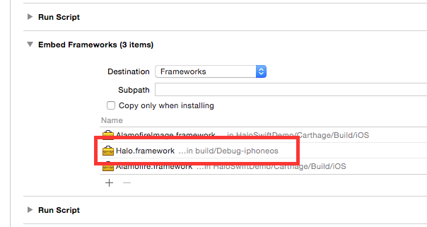
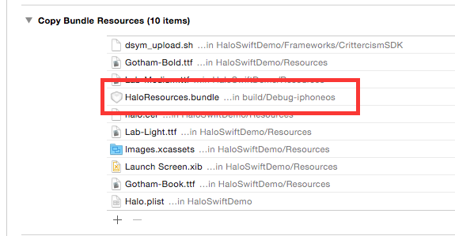
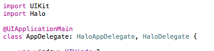
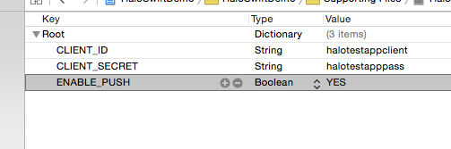

# HALO iOS SDK

  

## Getting started

### Initial setup

In order to start using the Halo SDK you will need to integrate the *Halo.framework* and the *HaloResources.bundle* into your project.

At the moment it will need to be built from source code, until a better distribution mechanism is arranged. So in order to do that, you will need to build a couple of targets (the Halo one and the HaloResources), and that will provide you with the two files you need to integrate: *Halo.framework* and *HaloResources.bundle*.

Those need to be added in two separate places. In the Build Phases section:

The framework one needs to be added as embedded framework as seen in the image.

The resources bundle has to be added in the Copy Bundle Resources phase

After that, you can start developing using the Halo SDK.

The initial step would be to set up your AppDelegate, that will inherit from the provided one in the SDK.

You will also have to implement the HaloDelegate if you are thinking of enabling push notifications, that will provide some methods to be implemented in order to handle them easily.

The final configuration step is to provide the client id and secret for the app, as well as whether it will be using push notifications or not. That can be done through code, but it's probably easier to set up a Halo.plist file inside the main bundle of the app, containing the following keys

### The Halo Manager

The Halo Manager is the main class that will provide most of the functionalities. In order to access it, you will access the sharedInstance (Singleton) and from there you will be able to use it.

At the moment the Halo SDK supports using several environments (Int, QA, Stage), so setting any of those (it's a Manager's property) will trigger the launch process, that will register the device for push notifications (if enabled) and a series of other configuration operations.

Some more detailed information about the available API can be found in the link provided in the next section.

## API documentation

The latest API documentation can be checked [here](http://borjasantos.bitbucket.org/docs/ios/halo-sdk/).

## Contribute

In order to start developing the Halo SDK, there are some required packages/tools to be installed first:

* [Carthage](https://github.com/Carthage/Carthage) to manage third-party libraries/SDKs. It can easily be installed using [Homebrew](http://brew.sh/) with `brew install carthage`
* [Jazzy](https://github.com/Realm/jazzy) a Ruby gem that provides Apple-like documentation. It can be installed using `[sudo] gem install jazzy`.

Once that's done, the initial setup of the project can be done. From the root folder of the project you can run:

* `carthage bootstrap --platform iOS` will set up the project, downloading any extra libraries/SDKs needed.

... and you're done! Enjoy developing this wonderful SDK! :heart: