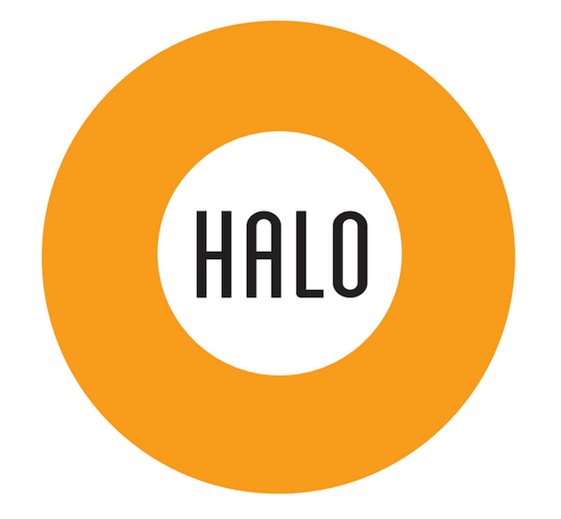

# HALO iOS SDK

## Initial setup

In order to start developing the Halo SDK, there are some required packages/tools to be installed first:

* [Bundler](http://bundler.io/) to manage Ruby gems dependencies. It can be installed using `[sudo] gem install bundler`
* [Carthage](https://github.com/Carthage/Carthage) to manage third-party libraries/SDKs. It can easily be installed using [Homebrew](http://brew.sh/) with `brew install carthage`
* [Jazzy](https://github.com/Realm/jazzy) to provide Apple-like documentation. It will be installed later using Bundler.

Once that's done, the initial setup of the project can be done. From the root folder of the project you can run:

* `bundle install` will install all the gems needed for the development of this project.
* `carthage bootstrap --platform iOS` will set up the project, downloading any extra libraries/SDKs needed.

... and you're done! Enjoy developing this wonderful SDK! :heart: